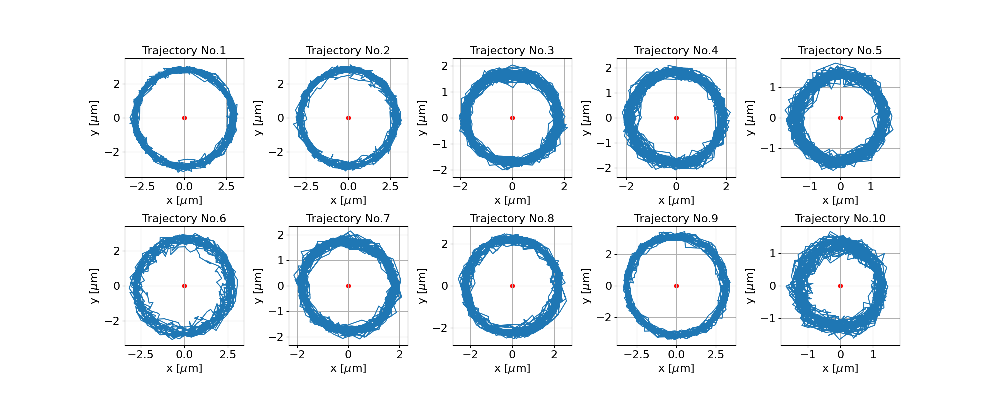
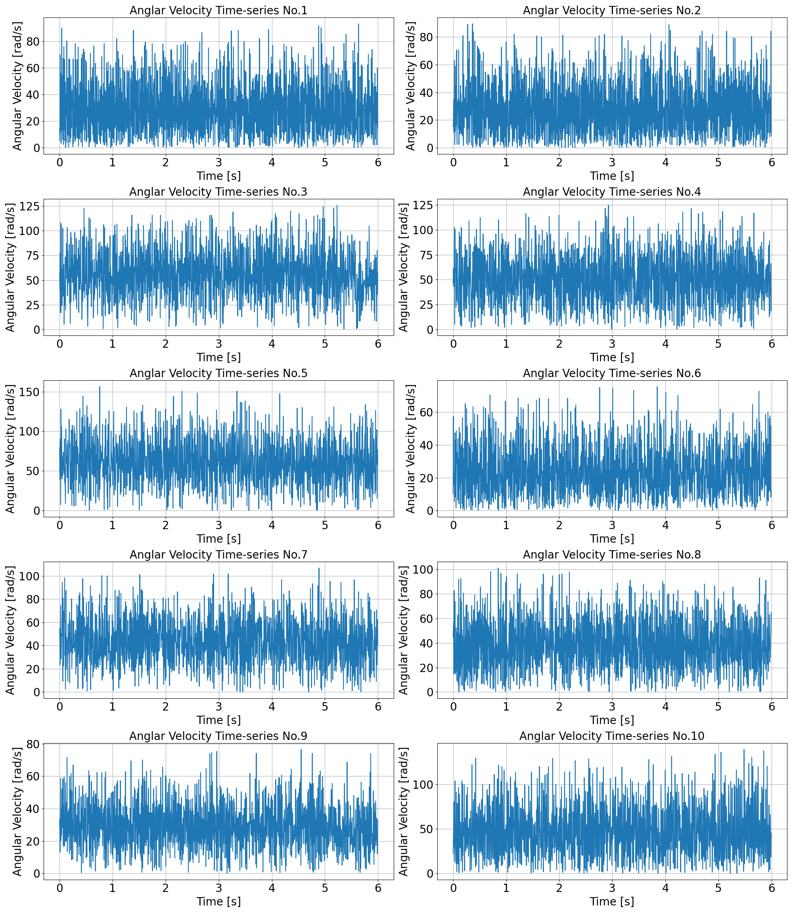
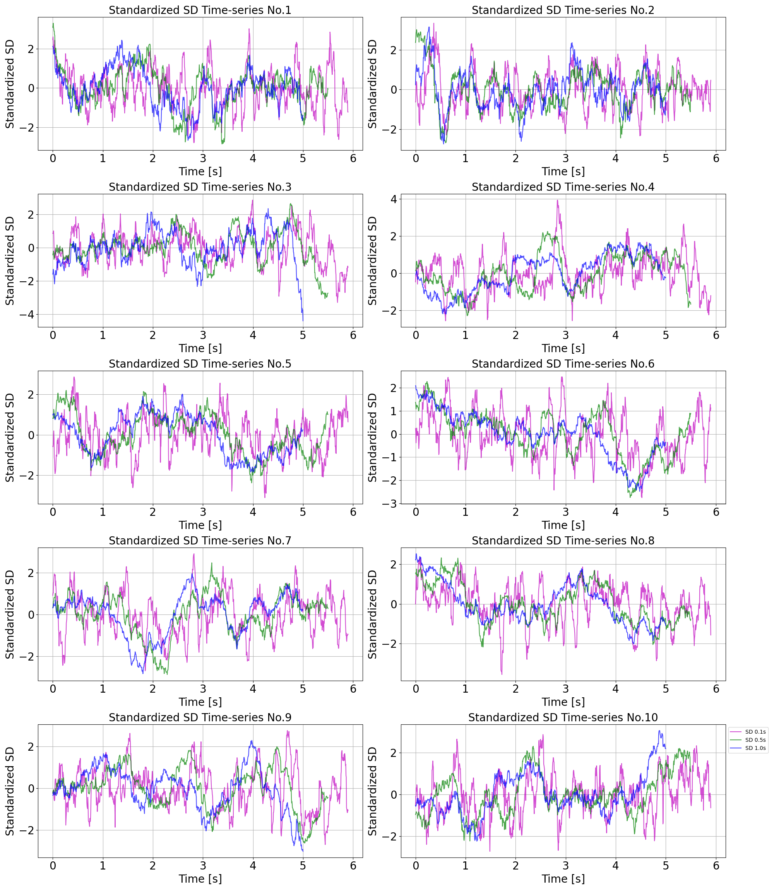

# BactRotAnalyzer
バクテリアの回転データ解析スクリプト

## 1. 概要
本プロジェクトでは，バクテリアの回転データを解析する．入力は二値化後の動画像データである．

### 1.1. 回転解析
回転解析では，トラジェクトリーや時系列角速度を算出し，プロット・数値の保存を行う．




### 1.2. 揺らぎ解析
揺らぎ解析では，独自の解析手法を用いた揺らぎ評価を行う．



## 2. 実行環境設定
本プロジェクトでは，以下のライブラリが必須である．'requirements.txt'を用いてインストールください．
- numpy==1.24.4
- opencv-python==4.8.0
- pandas==2.0.3
- matplotlib==3.7.2

```bash
pip3 install -r requirements.txt
```

## 3. 実行方法
### 3.1. 解析用データの用意
`/data`に解析したい動画データを配置．
- データは二値化したAVIデータ
- `config.ini`を設定
命名規則等の詳細は，`/data`のREADMEに記載．

### 3.2. 解析スクリプトの実行
`/scripts`に移動し，`..._main.py`を実行する．<br>
回転解析は，`ratation_analysis_main.py`，揺らぎ解析は`fluctuation_analysis_main.py`により実施する．引数は，`/data`のファイル名にする．
詳細は`/scripts`のREADMEに記載．

### 3.3. 解析結果の確認
解析結果は`outputs/`に保存されている．重心座標は`centroid_coordinate`，時系列角度・角速度は`angular_velocity`，揺らぎ解析は`fluctuation_analysis`に保存されている，<br>
出力結果の詳細は，`/outputs`のREADMEに記載．


## ライセンス
本プロジェクトは，クリエイティブ・コモンズ CC BY-NC-SA 4.0ライセンスの下で公開されています．

[CC BY-NC-SA 4.0](https://creativecommons.org/licenses/by-nc-sa/4.0/deed.ja)