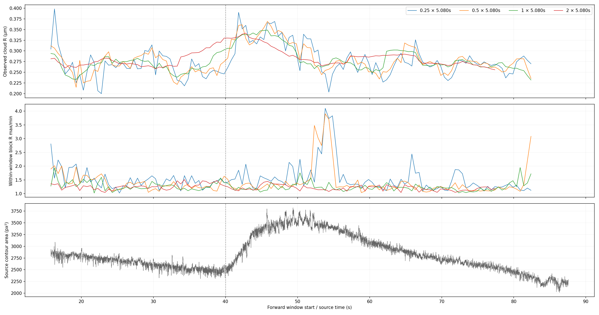
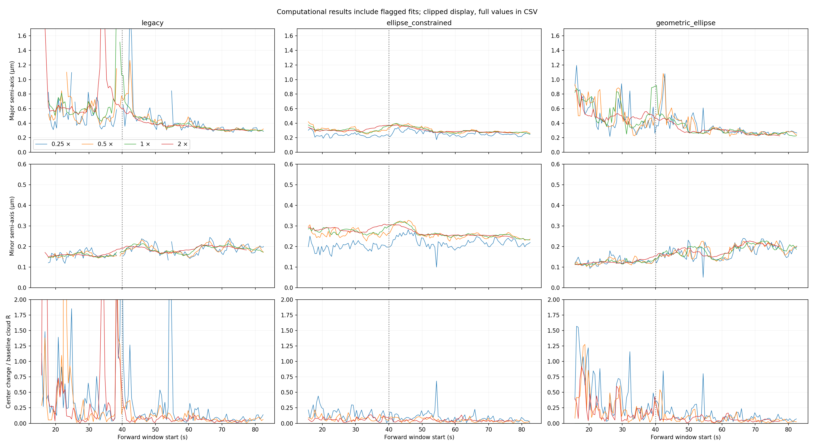

# No.14：元画像・軌道サイズと窓幅の評価、merge・引き継ぎ条件

## 結論

**5.080秒は比較の基準として残すが、最適な窓幅とは認定しない。** 元重心の広がりも時間とともに変化し、40秒付近には画像の輪郭面積の変化もある。一定中心・一定楕円を長い窓に当てはめる仮定は全区間には支持できない。一方、短縮だけでも序盤の境界到達や中心の不安定性は解消しない。

65秒以降では2.540秒と10.161秒の幾何学的楕円の中心は5.080秒と近く、半軸も比較的再現される。複数候補と窓幅の比較を #39 へ渡し、**最終手法・窓幅・無効判定・補完条件の決定は #39 に残す**。分析の証拠と再実行・品質確認が揃うことを #38 のmerge条件とする。物理的な許容誤差は設定しない。

## 入力・比較条件

保存済みの同一重心、原AVI2049–16384フレーム、TIFF由来時刻を用いる。既存134開始時刻に終端保持の開始82.500132秒を加え、135開始時刻×4窓幅×3楕円法＝1,620行を記録した。新たな重心抽出は行わず、画像からは輪郭面積・円形度・輪郭数・端接触のみ追加計測した。

窓幅は1.270092、2.540183、5.080367、10.160734秒。現行5.080367秒は刺激前の代表周波数約5.91Hzに対する30回転相当であり、全区間で実際に30回転を含むという意味ではない。すべて**同じ開始時刻からの前向き窓**である。完全な窓がない場合は`incomplete_window`とし、短く切ったデータを要求幅の推定に流用しない。

完全窓の開始時刻数は順に135、135、134、124。幅の集計比較は**4幅共通の124開始時刻（15.781025–77.382089秒）**に限る。窓は大きく重なり、124個の独立試行ではない。下記の区間は窓開始時刻で、実際の観測はその後の窓幅全体に及ぶ。38.318秒開始の1.270秒窓は40秒を含まず、5.080秒窓は43.398秒まで、10.161秒窓は48.479秒までを含む。長い窓の変化が早く表示されても、試料の変化が早く起きたと解釈しない。

```sh
python3 scripts/diagnostics/issue38_no14_window_scale.py
```

入力生成は[READMEの手順](../README.md)を参照。出力は以下。

- [全幅・全手法の計算表](../tables/no14_window_width_fits.csv)：原フレーム両端、時刻、計算状態、中心、半軸、保留残差、中心再推定幅。
- [中心を引かない軌道の広がり](../tables/no14_observed_orbit_extent.csv)、[窓内4時間ブロックの値](../tables/no14_observed_orbit_blocks.csv)。
- [全14,336フレームの画像計測](../tables/no14_source_morphology.csv)。

## 元データから見たサイズの変化

Rはx/yの5–95%幅の大きい方の半分。中心を使わず計測できる**観測点群の広がり**で、真の回転半径ではない。角度の被覆・重心位置の移動・輪郭の変化・軌道の変化も影響する。楕円の長半軸・短半軸と分けて扱う。輪郭面積は画像上の対象サイズで、軌道半径ではない。



以下は共通開始時刻での中央値。区間は左端を含み右端を含まない。

| 開始時刻 | 窓数 | R：1.270秒 | R：2.540秒 | R：5.080秒 | R：10.161秒 | 5.080秒内の4ブロックR最大/最小 |
| --- | ---: | ---: | ---: | ---: | ---: | ---: |
| 15–35秒 | 39 | 0.267 | 0.270 | 0.268 | 0.269 | 1.257 |
| 35–40秒 | 10 | 0.251 | 0.257 | 0.267 | 0.307 | 1.231 |
| 40–50秒 | 20 | 0.332 | 0.331 | 0.335 | 0.324 | 1.187 |
| 50–65秒 | 30 | 0.270 | 0.269 | 0.270 | 0.286 | 1.229 |
| 65–78秒 | 25 | 0.270 | 0.272 | 0.267 | 0.271 | 1.164 |

Rの単位はµm。5.080秒の観測Rは15–35秒の0.268から40–50秒の0.335へ約25%増え、65秒以降は0.267へ戻る。この変化は不適切な推定中心を引いたことだけでは説明できない。ただし物理的な半径の増減とは断定しない。

全画像で輪郭は1個、端接触は0。輪郭面積の中央値は35–40秒に2,494.5px²、40–45秒に2,912.25px²、45–65秒に3,360px²、65–82.5秒に2,635.25px²だった。40秒前後で輪郭と重心軌跡の両方が変わることを支持する。二値化済み画像のため、輪郭変化が物理的姿勢・焦点・元画像の閾値処理のどれに由来するかは分離できない。輪郭が1個であることも重心の物理的代表性の保証にはならない。

## 楕円半軸と中心の窓幅依存

保留残差は4時間ブロックを1つずつ除いてフィットした際の保留点から楕円までの幾何学的距離P95/R。中心再推定幅は全点での中心からの最大変化/R。計算状態が問題のある試行も数値を保存し、成立だけを選んで改善を主張しない。現行法で実楕円が成立しない場合も数値上の中心は別に残し、物理的中心として解釈しない。形状が返らない場合は残差・半軸が欠測となり、表にはその状態を残す。残差を計算できたブロック数と計算問題なしのブロック数も区別する。



図の表示上限は長半軸1.7µm、短半軸0.6µm、中心差2R。上限を超える値はCSVに保存している。破綻値を支持できる値と混同しない。

### 比較的再現される後半（共通25開始時刻、65–78秒）

幾何学的楕円の窓間中央値：

| 窓幅 | 長半軸µm | 短半軸µm | 保留残差P95/R | 中心再推定幅/R | 5.080秒中心との差中央値/R | 同差P95/R |
| --- | ---: | ---: | ---: | ---: | ---: | ---: |
| 1.270秒 | 0.266 | 0.203 | 0.496 | 0.087 | 0.078 | 0.167 |
| 2.540秒 | 0.260 | 0.210 | 0.461 | 0.055 | 0.036 | 0.075 |
| 5.080秒 | 0.253 | 0.212 | 0.466 | 0.034 | 0 | 0 |
| 10.161秒 | 0.240 | 0.213 | 0.457 | 0.032 | 0.040 | 0.065 |

幅間の中心差のみ5.080秒点群のRで正規化し、他の指標は各幅のRを使う。短縮すると時間ブロックへの中心再推定幅が増える。長くしても残差は大幅には改善せず、一定幅への置換を決める根拠はない。2.540–10.161秒の長半軸の中央値は0.240–0.260µm、短半軸は0.210–0.213µm。ただし個々の窓の物理的中心や軸の真値を保証する数値ではない。

現行法の同期間の5.080秒半軸中央値は0.311/0.200µm、制約付き代数は0.278/0.255µm、幾何学的方法は0.253/0.212µm。**同じ点群でもモデルにより半軸が違う**ので、半軸列をそのまま真の回転半径として採用しない。

### 序盤・変化付近

15–35秒の幾何学的方法では、5.080秒中心との差P95は1.270秒で1.255R、2.540秒で0.896R、10.161秒で0.726R。5.080秒のブロック中心再推定幅中央値も0.394Rで、幅変更のみでは中心を確定できない。

全開始時刻の幾何学的方法の境界到達は各幅19/17/15/4件、未収束は5.080秒で1件。10.161秒は完全窓124件で他の幅より対象が少なく、境界件数の単純比較だけでは優位性を判断しない。制約付き代数法は全完全窓で計算成立するが、形状情報不足への耐性を意味しない。[短い弧・停止点群の確認](no14_ellipse_assessment.md)も参照。

| 対応図 | 幾何学的方法の結果と解釈 |
| --- | --- |
| [15.781秒開始](../figures/no14_window_width_initial_invalid.png) | 1.270/2.540/10.161秒は境界到達。5.080秒も保留中心再推定幅0.634R。幅変更で支持できる中心は得られない。 |
| [20.789秒開始](../figures/no14_window_width_early_displaced.png) | 1.270/2.540/5.080秒は境界到達。10.161秒は計算成立するが中心再推定幅0.531R、保留残差0.746R。成立と妥当性を分ける。 |
| [38.318秒開始](../figures/no14_window_width_rise_crossing.png) | 長半軸は幅順に0.330/0.467/0.512/0.522µm。5.080秒の窓内ブロックR比は1.431。40秒をまたぐ観測の混在とフィットの形状依存がある。実際の中心ドリフトと断定しない。 |
| [64.862秒開始](../figures/no14_window_width_later_reference.png) | 2.540/10.161秒中心は5.080秒から0.037/0.054R。1.270秒は0.180R、ブロック中心再推定幅0.211R。短縮が常に有利ではない。 |
| [82.500秒開始](../figures/no14_window_width_terminal_hold.png) | 1.270/2.540秒なら完全窓があり計算可能。5.080/10.161秒は不完全。短い窓で新しく計算できても、現行の保持値の妥当性や終端の置換規則を保証しない。 |

## merge・引き継ぎ条件の確定

### #38のmergeに必要なもの

- **入力対応**：同一の確定済み重心・原フレーム・時刻。フレーム欠落を詰めず、幅間比較でも原番号両端を保存する。
- **証拠**：現行134窓の3楕円法比較、代表5区間の画像対応図、原点・初期値・探索範囲・反復数の確認、および今回の4幅比較と中心に依存しないサイズ・元画像の計測。
- **解釈**：計算状態と科学的支持を分け、前向き窓の観測時間、不完全窓、重なる窓、真値なしという限界を明記する。原因を確定できない箇所は未確定として残す。
- **再利用・再実行**：データ名に依存しない候補API、診断コード、表・図・リンクが揃うこと。
- **品質**：既知楕円・平行移動・短い弧・停止・欠測等のテストと既存テスト・CIが通り、本解析の既定中心・角速度・反転判定・補完を変更しないこと。結果はPRに記録する。
- **引き継ぎ**：#38と#39から比較結果と未決定事項を参照できること。

上記を揃えれば分析としてmerge可能とする。**代替法の支持、全時刻の中心確定、最適窓幅や採用閾値の決定はmergeの必須条件にしない。** 実際のmergeはPRで行う。

### #39で詰めるもの

1. 既知中心のテスト動画で、楕円軸比・被覆不足・停止/反転・中心移動・軌道サイズ変化を分け、同じ入力で候補2法と現行法を検証する。
2. 窓幅と時間位置（前向き/中央等）を比較し、時間分解能と軌道情報量の関係から選択規則を決める。今回の4幅は比較条件であり採用規則ではない。
3. 中心を使わない周期性・x/y位相関係・時間ブロックごとの軌道情報を追加し、停止と厚い回転軌跡を区別する。ブロック中心が安定するだけではドリフトを確定しない。
4. 計算状態と真値誤差から中心無効判定を定め、実際の欠測・停止・フィット破綻・終端をそれぞれ補完可能か検証する。中心列だけを人工的に隠した参考試験からは決めない。
5. 半軸・中心の違いが角速度へ与える影響と、最終採用法を評価する。許容範囲を設定する場合は今回の探索的比較と分け、評価データの結果に合わせて後付けしない。

今回の結果だけで、物理的半径の変化量、40秒付近の変化原因、停止/反転の時刻、終端の真の中心を確定することはできない。それらを確定したことにせず次の検証条件へ渡す。

## 今回の確認記録

5.080秒×3法の402行は既存比較の計算状態と一致し、両表で記録された中心の差はx/yとも0。旧比較表が欠測としていた非楕円5件のみ、新表では数値上の中心を別に保持している。原フレームは2049–16384の連番、時刻は単調増加、px/µmの0.02換算を確認した。既存41テスト通過、Ruff・isort・Black・mypy通過、資料のローカルリンク欠落0。新コミットのGitHub CIはPRに結果を記録する。
